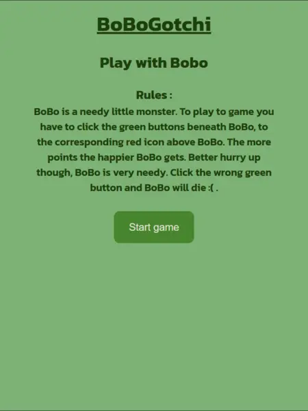
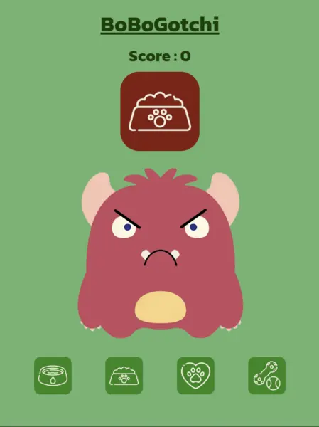
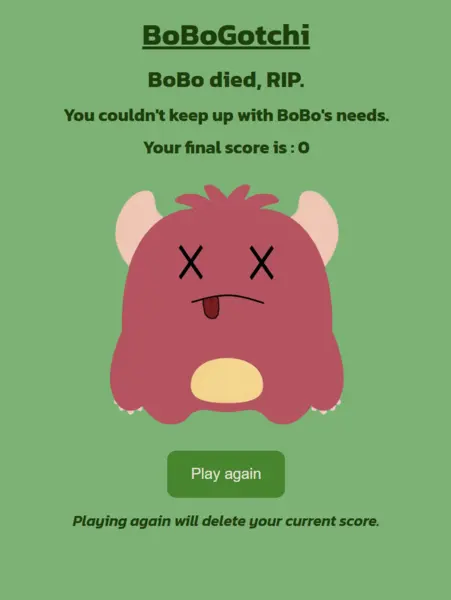
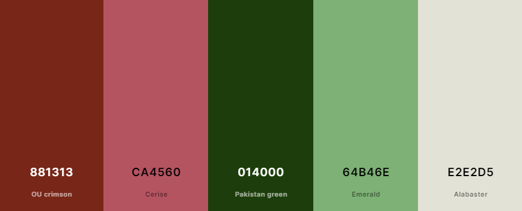
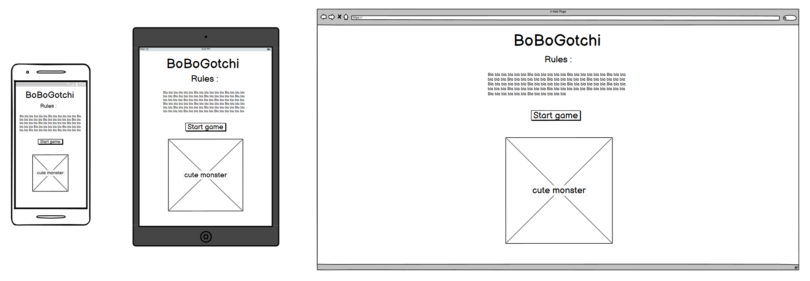
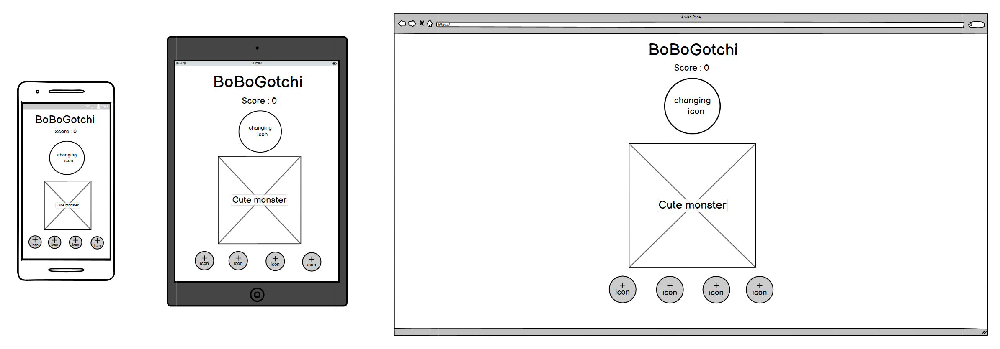
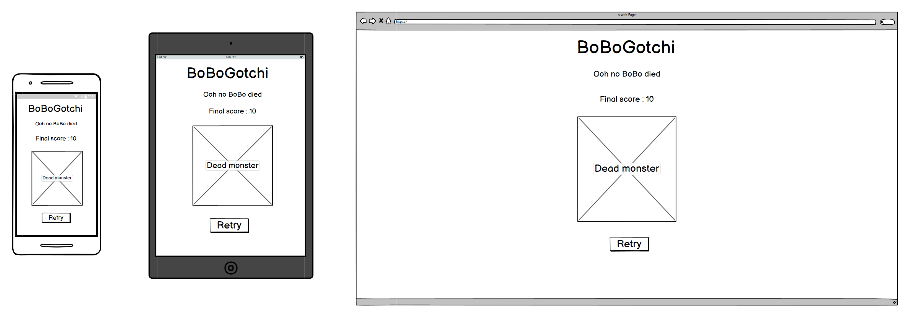
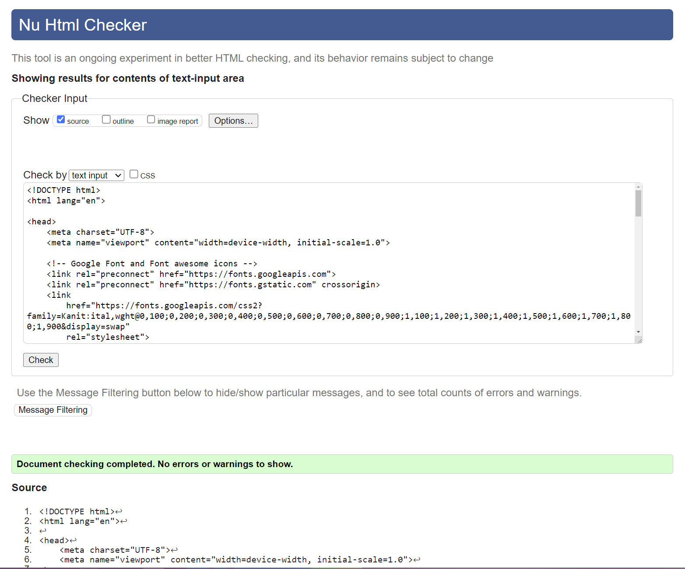
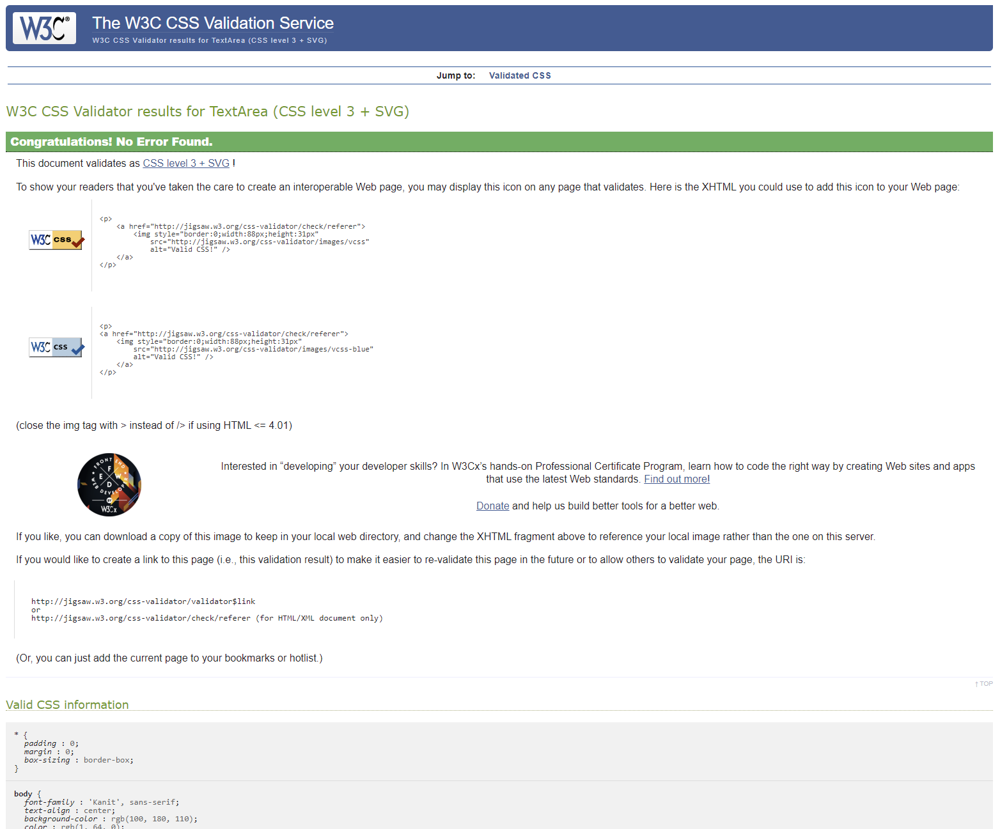
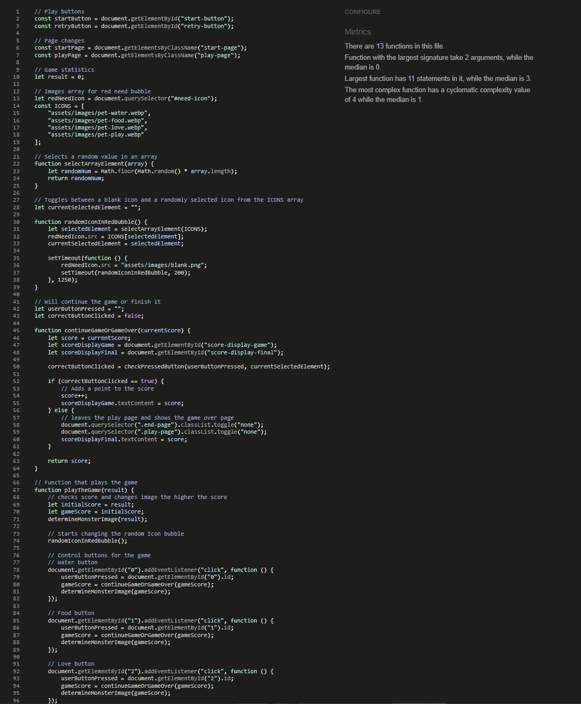

# BoBoGotchi

 

 

[Click on this link to visit the game](https://obiwanbonobi.github.io/PP2/)

 

# Content

- [Introduction](#introduction)
    * [User experience](#user-experience)
    * [My vision for the game](#my-vision-for-the-game)
- [Features](#features)
    * [Navigation](#navigation)
    * [Start page](#start-page)
    * [Play page](#play-page)
    * [End page](#end-page)
- [Future features](#future-features)
- [Design](#design)
- [Technologies used](#technologies-used)
   * [Balsemiq](#balsemiq)
- [Testing](#testing)
    * [Validation HTML, JavaScript and CSS](#validation-html-javascript-and-css)
    * [Lighthouse test](#lighthouse-test)
    * [Testing on devices and browsers](#testing-on-devices-and-browsers)
- [Bug fixes](#bug-fixes)
- [Deployment](#deployment)
- [Credits](#credits)

 

# Introduction

I created this JavaScript game, BoBoGotchi, with the aim of providing an engaging and entertaining experience for users while also honing my programming skills. The motivation behind developing this game stemmed from a desire to combine creativity and technology, offering players an enjoyable way to spend their time. I envisioned the game as a means to create something that brings joy and a sense of accomplishment to those who engage with it.

### User experience

My thought process for this game was to create a game in a similar vibe as flappybird. I wanted it to be cute but also slightly frustrating. The icons change quickly for a more rushed and difficult experience. The cute monster, called BoBo, brings good vibes to the page.

### My vision for the game

I wanted the website to look cute and fun. An enjoyable experience, something not too boring. I've optimized the site for all devices, ensuring that whether on a desktop, tablet, or smartphone, the content remains accessible and aesthetically pleasing. I've paid close attention to loading times to keep the user engaged and prevent frustration. 

 

# Features

### Navigation

You first arrive on the start page, which contains a start button that will lead you to the play page. After you press the wrong button and you killed the cutest monster ever, the end page will show. Here is a retry button that will reload the page and you will be back on the start page.

 

### Start page

Shows the name of the game at the top that stays there throughout all the pages. The rules for the game are shown underneath the game name. I kept it short for a better user experience. And underneath the rules is the start button that will show the play page.

 

### Play page

At the top of the page you see your current score, that adds a point everytime you press the correct button. Underneath that is the need icon, that shows what BoBo wants for the next second. It shows a "blank image" (three dots) inbetween every need icon for easier visuals. Underneath the need icon is BoBo. He shows a different facial expression the more points you get. And underneath BoBo are the play buttons, these buttons need to be pressed when the corresponding icon is showing to score points. 

 

### End page

After you've pressed the wrong button and you straigt up murdered the cutest monster, you will be taken to the end page. Here you can see your final score at the top. And underneath that is an image of dead BoBo (how dare you). Finally at the bottom is the retry button that will reload the page and show the start page again.

 

 

# Future features

- I want to add a scoreboard that save your previous tries and top score.
- For the need icon, I want to make it so you can only add one point per icon shown.
- I want to add a timer to the need icon that goes quicker the more points you get.
- I want to change BoBo's images more so it doesn't look so static.

 

# Design

- <b>Font</b> : I got my font from [google fonts](https://fonts.google.com/).
- <b>Icon images</b> : I got the images for the play buttons from[flaticon](https://www.flaticon.com/).
- <b>Favicon generator</b> : I made my own favicon with [this website](https://favicon.io/).
- <b>Image resizing</b> : I used this [Image resizer](https://imageresizer.com/) website to change my images.

### Colour scheme

I wanted to use cute and bright colours for a fun look. And I gave it a water melon colour palette. I chose a simple design bit big buttons and not too much destraction.

 

 

# Technologies used

- The website is written in HTML, CSS and JavaScript.
- I did all my coding with the program VS Code, [Visual Studio Code](https://code.visualstudio.com/).
- All my code was uploaded to [Github](https://github.com/), to my [Github account](https://github.com/ObiWanBonobi).
- I used Google Chrome Dev Tools to test throughout the process of creating this game.

### Balsemiq

The project started with Balsamiq, where I imagined the beginning of the game on all device sizes.

 

 

 

 

# Testing

Every link and button on all pages got tested on several devices and webbrowsers :

- &#9745; The start game button on the start page
- &#9745; The water button on the play page
- &#9745; The food button on the play page
- &#9745; The love button on the play page
- &#9745; The play button on the play page
- &#9745; The retry game button on the end page

 

## Validation HTML, JavaScript and CSS

The HTML validator came back without any issues. I used [this website](https://validator.w3.org/) to test my code.

 

 

The CSS validator also came back without any issues. I used [this website](https://jigsaw.w3.org/css-validator/) to test my code.

 

 

The JavaScript validator also came back without any issues. I used [this website](https://jshint.com/) to test my code.

 

 

## Lighthouse test

## Testing on devices and browsers

I tested the deployed wedsite on several devices webbrowsers :
- Iphone 14
- Google pixel 7
- Samsung galaxy tab S6
- HP envy 
- PC build
- Apple Macbook

 

- Google chrome
- Microsoft edge
- Apple Safari

# Bug fixes

 

# Deployment

The website was deployed to my account on GitHub pages. The steps I took to deploy the website went as followed : 
  - Go to my [GitHub repository called PP2](https://github.com/ObiWanBonobi/PP2).
  - In there, I navigated to the Settings tab.
  - From the source section drop-down menu, I selected the Master Branch.
  - Once the master branch has been selected, the page will be automatically refreshed with a detailed ribbon display to indicate the successful deployment. 

To fork this repository on Github, you have to :
  - Go to my [GitHub repository called PP2](https://github.com/ObiWanBonobi/PP2).
  - In the top-right corner of the page, click Fork.
  - Under "Owner," select the dropdown menu and click an owner for the forked repository.
  - By default, forks are named the same as their upstream repositories. Optionally, to further distinguish your fork, in the "Repository name" field, type a name.
  - Click Create fork.

To clone this repository, you have to :
  - Go to my [GitHub repository called PP2](https://github.com/ObiWanBonobi/PP2).
  - Above the list of files, click  Code.
  - Copy the URL for the repository.
  - Open Git Bash.
  - Change the current working directory to the location where you want the cloned directory.
  - Type git clone, and then paste the URL you copied earlier.
  - Press Enter to create your local clone.

You can see deployed wedsite [here](https://obiwanbonobi.github.io/PP2/).

 

# Credits

- <b>Code Ideas</b> : Some of my ideas grew from coding along projects called, [Love Math](https://github.com/Code-Institute-Org/love-maths) and [Love Running project](https://github.com/Code-Institute-Solutions/readme-template), created by Code Institute.
- <b>Code help</b> : I got some help from my mentor, [Oluwafemi Medale](https://github.com/omedale), who helped me with some future ideas. And my brother in law, [Steffen Bjerkenås](https://github.com/stebje), who taught me a lot about JavaScript and helped me with some of the code.
- <b>README</b> : I copied some of the Readme code from my [previous Project](https://github.com/ObiWanBonobi/PP1/blob/main/README.md).
- <b>JavaScript</b> : I got some of my JavaScript ideas from [this online project](https://codepen.io/Creasium/pen/NWGOGrr?editors=1000). And learned a lot from [the YouTube channel freeCodeCamp.org](https://www.youtube.com/@freecodecamp).
- <b>Picture</b> : I got my little monster image from [this website](https://www.vectorstock.com/royalty-free-vector/cute-cartoon-monsters-vector-18671920). I changed the look of the face with Paint 3D.
- <b>Deployment info</b> : I got the [fork](https://docs.github.com/en/get-started/quickstart/fork-a-repo) and [clone](https://docs.github.com/en/repositories/creating-and-managing-repositories/cloning-a-repository) info from the Github help page.
- <b>Learning</b> : 
  * [This website](https://www.basedash.com/blog/how-to-add-an-image-in-an-array-in-javascript) helped me to understand how to add images to a JavaScript file.
  * [Thie website](https://stackoverflow.com/questions/63591210/hide-elements-after-a-certain-value-with-javascript) helped me understand how to add my red needs bubble.
  * [This website](https://codepen.io/Suza_3/pen/xxbLLzP?editors=1010) helped me undertand better how to randomize my images.
  * [This Youtube video](https://www.youtube.com/watch?v=ec8vSKJuZTk) helped me understand JavaScript better.
